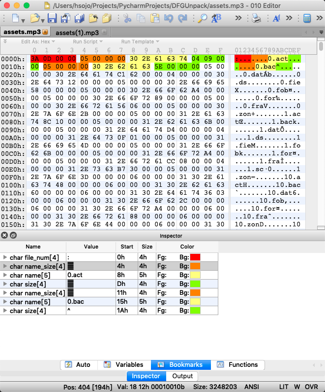
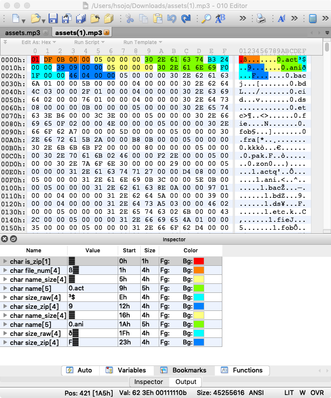
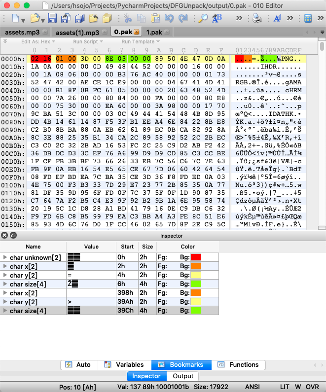

# DFGUnpack

## Part 1 - Assets File

### Normal Case

~~~cpp
// This is fake code to mean the format.

struct file {
    int name_size,
    string name,
    int size,
};

struct assets{
    int file_num,
    file[file_num] files,
    byte[file.size][file_num] data,
};
~~~

### Zip Case

~~~cpp
// This is fake code to mean the format.

struct file {
    int name_size,
    string name,
    int size_raw,
    int size_zip,
};

struct assets{
    bool is_zip,
    int file_num,
    file[file_num] files,
    byte[file.size][file_num] data,
};
~~~

## Part 2 - Pak File

~~~cpp
// This is fake code to mean the format.

struct image {
    short x,  // offsetX, maybe.
    short y,  // offsetY, maybe.
    int size,
    byte[size] data,
};

struct pak{
    short unknown,  // 2 byte, maybe short.
    image[?] imgs,  // unknown length, should read to the end of file.
};
~~~